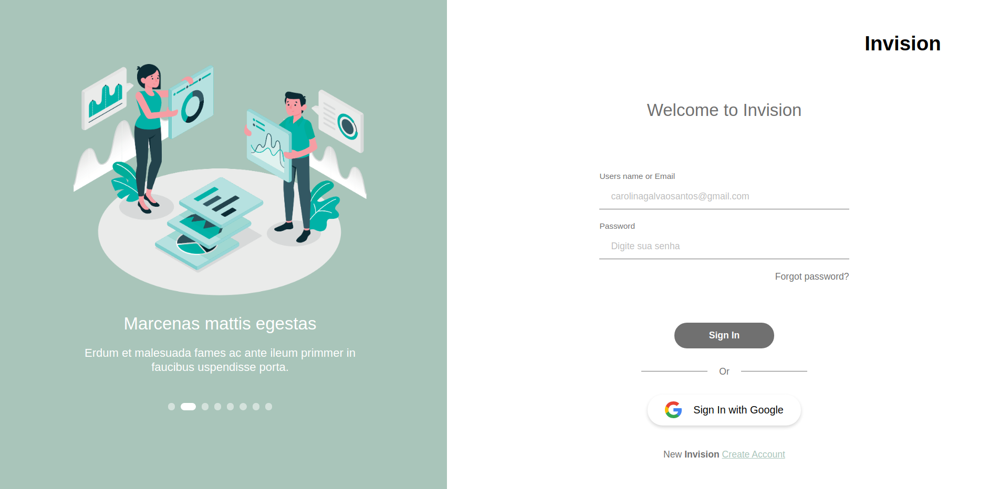

# Invision Web

> Login App :)

[](https://github.com/kaiorr)
[](#)
[](https://github.com/kaiorr/invision/stargazers)
[](https://github.com/kaiorr/invision/network/members)
[](https://github.com/kaiorr/invision/graphs/contributors)

---

# :pushpin: Table of Contents

* [Features](#rocket-features)
* [UI Documentation](#framed_picture-ui-documentation)
* [Installation](#construction_worker-installation)
* [Getting Started](#runner-getting-started)
* [FAQ](#postbox-faq)

<br />

# :rocket: Features

  #### Tela de entrada (sign-in)

- [x] Do lado esquerdo da página, você pode ver o slider com as imagens, que devem ser alternadas automaticamente e abaixo deste o usuário deve poder alternar as imagens clicando nos botões de navegação.
- [x] O usuário deve ser capaz de entrar um nome de usuário e também uma senha.
- [x] O campo de nome de usuário deve aceitar apenas e-mail, e este campo deve validar se o e-mail está correto. Se estiver incorreto, mostrar a imagem “o e-mail está incorreto”.
- [x] Todos os campos devem ser preenchidos e não podem ser deixados em branco.
- [x]Todos os campos inválidos devem ser marcados como tal utilizando uma borda de cor vermelha e mostrar a mensagem (*Este campo não pode ser vazio).
- [x] Colocar o botão Sign-in com Google.
- [x] Se o usuário ainda não tem uma conta, ele deve ser capaz de navegar para a tela de registro (sign-up) clicando o link “Novo no Invision? Crie uma conta”.


#### Tela de Registro (sign-up)

- [x] Do lado esquerdo da página de sign-up, você pode ver o slider com as imagens, que devem ser alternadas automaticamente e abaixo deste o usuário deve poder alternar as imagens clicando nos botões de navegação.
- [x] Todos os campos devem ser preenchidos e não podem ser deixados em branco.
- [x] Todos os campos inválidos devem ser marcados como tal utilizando uma borda de cor vermelha e mostrar a mensagem (*Este campo não pode ser vazio).
- [x] O campo de senha deve aceitar uma senha de pelo menos 6 caracteres. Se o usuário entrar menos que 6 caracteres, a mensagem “A senha não pode ter menos de 6 caracteres” deve ser exibida.
- [x] Se o usuário já tem uma conta, ele deve ser capaz de navegar para a tela de entrada (sign-in) clicando o link “Já está no Invision? Entre”.

#### Tela de Reset Password

- [x] Tela Reset password criada você pode ver o slider com as imagens, que devem ser alternadas automaticamente e abaixo deste o usuário deve poder alternar as imagens clicando nos botões de navegação.
-[x] Todos os campos devem ser preenchidos e não podem ser deixados em branco.
- [x] Todos os campos inválidos devem ser marcados como tal utilizando uma borda de cor vermelha e mostrar a mensagem (*Este campo não pode ser vazio).
- [x] O campo de senha deve aceitar uma senha de pelo menos 6 caracteres. Se o usuário entrar menos que 6 caracteres, a mensagem “A senha não pode ter menos de 6 caracteres” deve ser exibida.
- [x] Validando oldPassword e newPassword para confirmar que a senha anterior será diferente da senha já cadastrada.
- [x] Se o usuário já tem uma conta, ele deve ser capaz de navegar para a tela de entrada (sign-in) clicando o link “Já está no Invision? Entre”.

# :framed_picture: UI Documentation

<p align="left">
   
</p>

# :construction_worker: Installation

**You need to install [NPM](https://www.npmjs.com/) and [YARN](https://yarnpkg.com/) first, then in order to clone the project via HTTPS, run this command:**

```git clone https://github.com/kaiorr/invision.git```

SSH URLs provide access to a Git repository via SSH, a secure protocol. If you have a SSH key registered in your Github account, clone the project using this command:

```git clone git@github.com:kaiorr/invision.git```

**Install dependencies**

You need to install the dependencies of the project, so **run the above command on root folder**:

```yarn```

# :runner: Getting Started

Run the following command to start the application in a development environment:

```yarn start```

# :runner: Test Started

```yarn test```

or run test coverage report

```yarn test:coverage```

# :postbox: Faq

**Question:** What are the technologies used in this project?

**Answer:** The technologies used in this project are [React JS](https://pt-br.reactjs.org/), [Typescript](https://www.typescriptlang.org/), [Styled Components](https://styled-components.com/), [Unform](https://unform.dev/), [Yup](https://github.com/jquense/yup), and [Jest](https://jestjs.io/).
